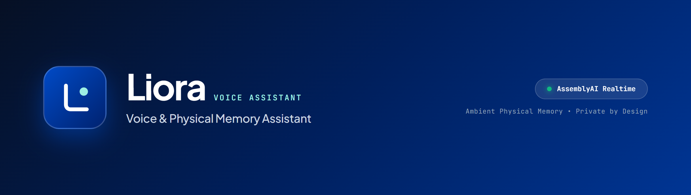
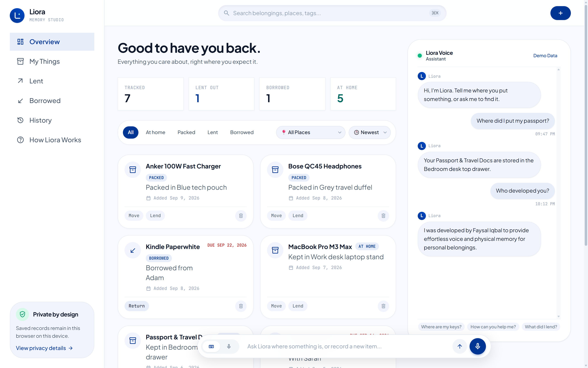
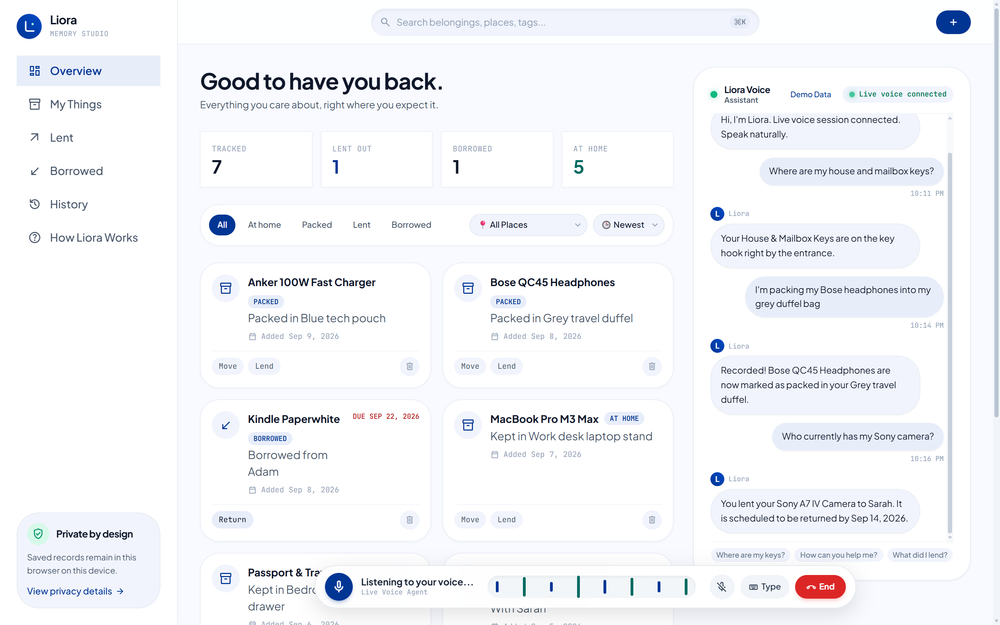
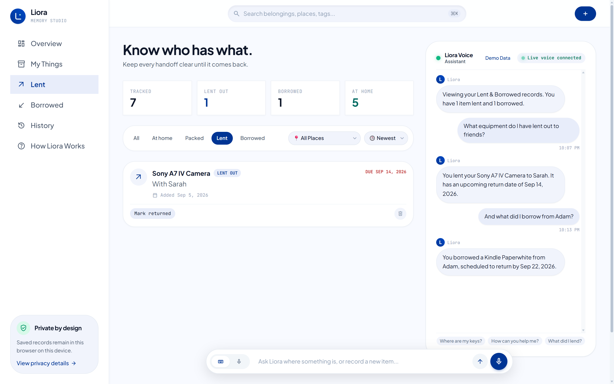
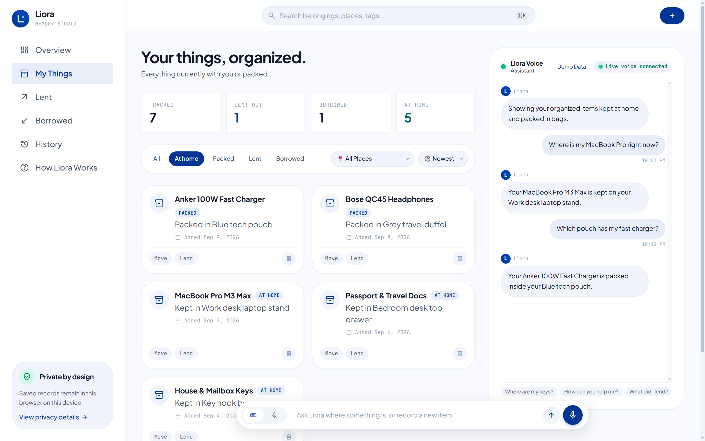
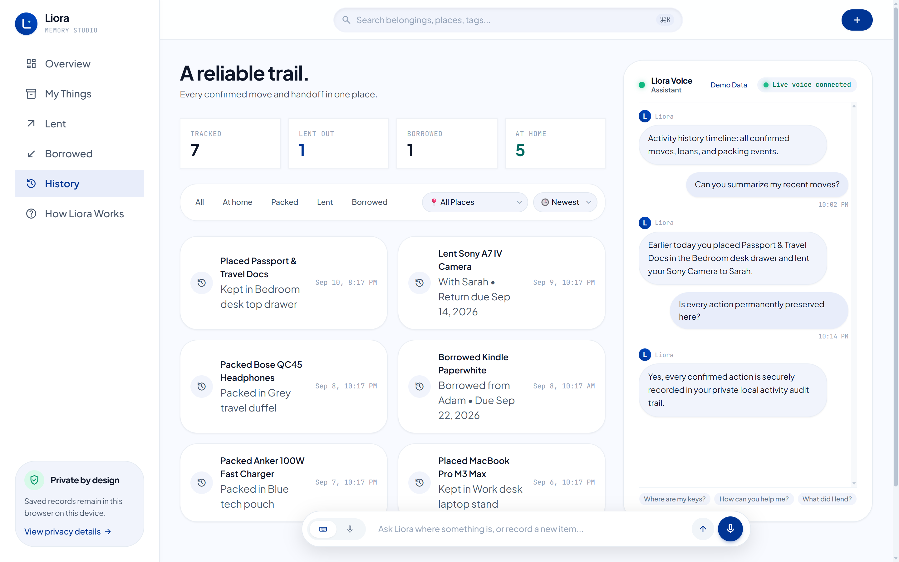
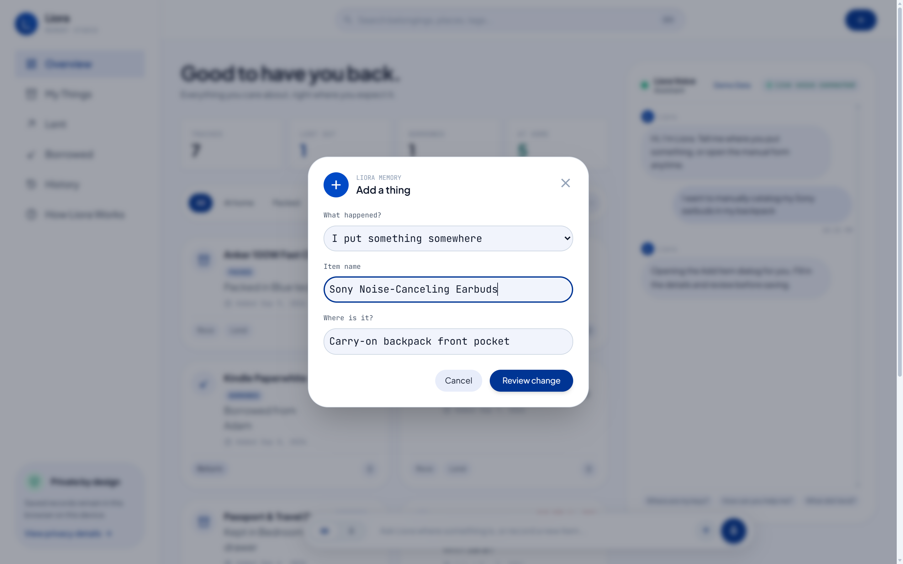
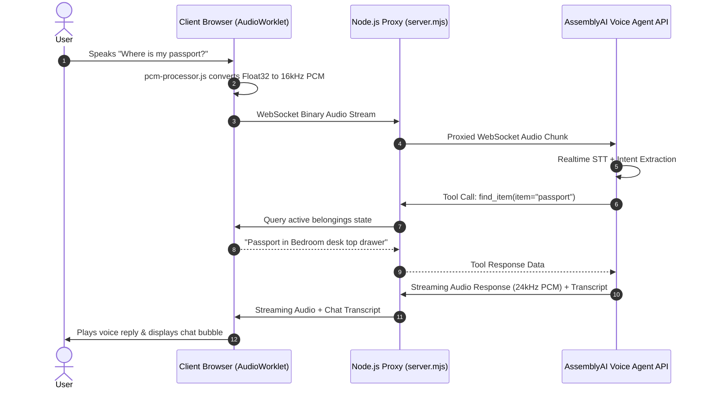
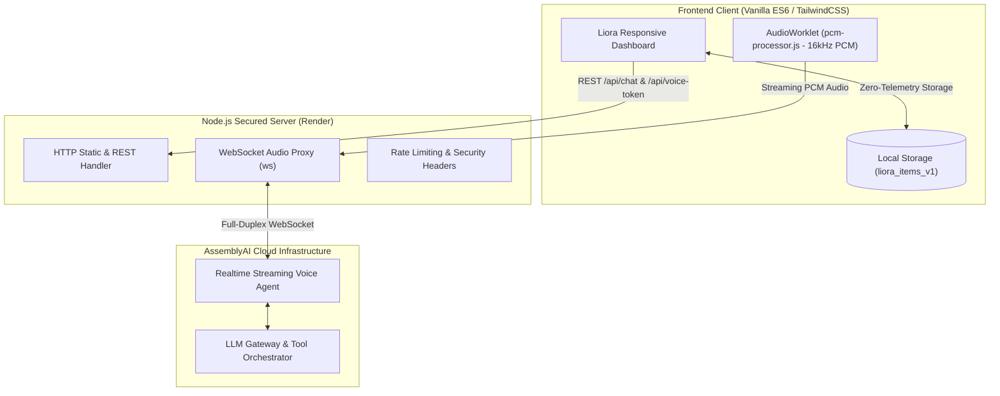

<div align="center">



<br/><br/>

# 🎙️ Liora — Voice & Physical Memory Assistant

**Tell Liora where something goes once. Ask for it whenever you forget.**

*A voice-first physical memory assistant powered by AssemblyAI's Realtime Voice Agent API. Built to keep track of physical belongings, packed luggage, lent gear, and borrowed tools with zero friction.*

[](https://liora-0w0l.onrender.com)
[](https://github.com/faysaliqbal007/Liora)
[](https://www.assemblyai.com)
[](https://nodejs.org)
[](LICENSE)

[**🌐 Live Application**](https://liora-0w0l.onrender.com) • [**📸 Visual Walkthrough**](#-visual-walkthrough) • [**⚡ Voice Agent Pipeline**](#-assemblyai-realtime-voice-agent) • [**🏗️ Architecture**](#%EF%B8%8F-technical-architecture) • [**🚀 Quick Start**](#-quick-start--local-setup)

</div>

---

## 📌 Problem & Solution

People spend hours every year searching for misplaced passports, wondering which travel bag has their laptop charger, or forgetting who borrowed their equipment. Traditional inventory and reminder apps fail because they require rigid data-entry forms, multiple clicks, and high cognitive overhead.

**Liora transforms physical memory into a natural voice conversation:**
1. **Effortless Voice Input**: Speak naturally — *"I packed my noise-canceling headphones in the grey travel duffel"* or *"I lent my camera to Sarah until next Monday"*.
2. **Instant Spatial Retrieval**: Ask whenever you forget — *"Where is my passport?"* or *"Who currently has my camera?"*.
3. **Safety by Design**: Every state change or move is drafted first and requires user confirmation before saving. Bulk deletion is strictly forbidden.
4. **100% Client Privacy**: All personal item descriptions and physical locations stay private inside your browser's local storage on your device.

---

## 📸 Visual Walkthrough

### 1. Main Dashboard & Central Hub
The command center displays your physical inventory at a glance with real-time statistics, active belongings cards, location filtering, and the integrated conversational assistant.



- **Realtime Metric Counters**: Live tally of **Tracked** belongings, active **Lent Out** items, **Borrowed** possessions, and items stored **At Home**.
- **Smart Category Filtering**: Seamless switching across **All**, **At home**, **Packed**, **Lent**, and **Borrowed**.
- **Location & Sorting Controls**: Filter by specific home spaces (*Bedroom desk top drawer*, *Key hook by entrance*, *Work desk laptop stand*) and sort by newest activity.
- **Embedded Assistant Transcript**: Multi-turn dialogue history with pre-configured suggestion chips and quick-load demo records.

---

### 2. Live Realtime Voice Session (Active Microphone)
Engage in hands-free, bi-directional voice dialogue with Liora. Powered by AssemblyAI's Realtime Voice Agent API with sub-second latency and intelligent speech recognition.



- **Floating Voice Capsule**: Dynamic floating control bar displaying real-time speech status (*"Listening to your voice..."*), audio equalizer waveform, and quick controls.
- **Visual Equalizer Waveform**: Responsive multi-frequency audio equalizer bars reflecting live speech input.
- **Active Connection Indicator**: Glowing emerald badge confirming live full-duplex WebSocket connection to AssemblyAI's voice pipeline.
- **Full Hands-Free Workflow**: Speak your queries naturally, hear Liora's spoken reply, and review live transcripts without touching the keyboard.

---

### 3. Lent & Borrowed Management
Keep transparent, reciprocal records of peer-to-peer handoffs and avoid awkward forgotten belongings.



- **Borrower & Lender Attribution**: Clear cards displaying who holds each item (e.g., *"With Sarah"* or *"Borrowed from Adam"*).
- **Return Due Dates**: Prominent red due-date badges ensuring items are returned on schedule (e.g., *"DUE SEP 14, 2026"*).
- **One-Click Return Resolution**: Mark items as returned with instant relocation back to your home inventory.

---

### 4. Organized Storage & Packed Gear
Track items across specific rooms, shelves, boxes, and travel bags so you never have to unpack luggage just to check if you brought a cable.



- **Compartment Precision**: High-resolution location labels (e.g., *"Work desk laptop stand"*, *"Blue tech pouch"*, *"Grey travel duffel"*).
- **Direct Re-assignment**: Re-assign items to new spaces or pack them into travel bags with single-tap actions.
- **Single Item Management**: Individual item removal safeguards prevent accidental mass deletion.

---

### 5. Chronological Activity Audit Trail
A persistent, timestamped chronological history of every confirmed move, packing action, loan, and return.



- **Chronological Accountability**: Complete audit trail showing the date, time, and specifics of every change.
- **Non-Destructive Memory**: Event history persists even after items are returned or reorganized, giving you a complete physical memory ledger.

---

### 6. Interactive Quick-Add Dialog
When voice input is not preferred, the modal allows rapid manual cataloging with contextual presets.



- **Preset Action Categories**: Quickly pick between *I put something somewhere*, *I packed something*, *I lent something*, or *I borrowed something*.
- **Focused Form Fields**: Smart inputs for item title, storage location / recipient, and due dates with autofocus.

---

## ⚡ AssemblyAI Realtime Voice Agent

Liora is built from the ground up around **AssemblyAI's Realtime Voice Agent API**:

### Voice Pipeline Architecture
1. **Audio Capture**: Browser microphone input captured via `AudioContext` at 16kHz sample rate.
2. **AudioWorklet Processing**: `pcm-processor.js` runs in an isolated audio thread, converting Float32 audio buffers into raw linear 16-bit PCM chunks without blocking the UI thread.
3. **Secure WebSocket Proxy**: The Node.js server (`server.mjs`) securely bridges audio packets to AssemblyAI's realtime endpoint without exposing secret API keys to the browser.
4. **Speech-to-Speech & Function Calling**: AssemblyAI processes audio, extracts intents, invokes registered tools, and streams low-latency audio responses back to the browser.



### Registered Agent Tools
| Tool Name | Parameters | Purpose |
| :--- | :--- | :--- |
| `find_item` | `item: string` | Finds the exact location or status of a specific belonging. |
| `list_items` | `status: string, detail: string` | Lists belongings filtered by category (*stored, packed, lent, borrowed*) or container. |
| `draft_change` | `item, action, detail, due_date` | Prepares an on-screen confirmation card before modifying any record. Safeguards prevent mass deletion. |
| `get_creator_info` | `topic: string` | Explains the origins of Liora and introduces creator **Faysal Iqbal**. |

---

## 🏗️ Technical Architecture



---

## 🛡️ Security & Privacy Architecture

- **Zero Remote Storage**: Personal item descriptions and locations never leave your device. All state is held exclusively in `localStorage` (`liora_items_v1`).
- **Private Key Isolation**: The client frontend never receives the `ASSEMBLYAI_API_KEY`; all interactions pass through the authenticated Node backend proxy.
- **Hardened HTTP Response Headers**: Includes `X-Content-Type-Options: nosniff`, `X-Frame-Options: SAMEORIGIN`, and strict CORS policies.
- **Single-Item Deletion Constraint**: The voice agent prompt strictly disallows deleting all items at once, preventing accidental data loss through ambiguous voice commands.

---

## 🚀 Quick Start & Local Setup

### Prerequisites
- **Node.js** v18.0 or later
- **AssemblyAI API Key** (from [AssemblyAI Dashboard](https://www.assemblyai.com))

### 1. Clone the Repository
```bash
git clone https://github.com/faysaliqbal007/Liora.git
cd Liora
```

### 2. Environment Configuration
Copy the example environment file:
```bash
cp .env.example .env
```
Open `.env` and set your AssemblyAI API key:
```env
ASSEMBLYAI_API_KEY=your_assemblyai_api_key_here
PORT=8000
```

### 3. Run the Application
```bash
npm start
```
Open your browser at:
```text
http://localhost:8000
```

---

## 🧪 Interactive Walkthrough & Quick Guide (2 Minutes)

To experience the full capabilities of Liora:

1. **Load Pre-populated Belongings**: Click **"Demo Data"** in the top-right of the assistant panel to instantly load 7 realistic belongings and activity events.
2. **Start a Live Voice Session**:
   - Click the blue microphone button in the floating bottom console.
   - Notice the status updates to *"Listening to your voice..."* with live animated equalizer bars.
3. **Ask Location Queries**:
   - Speak: *"Where is my passport?"* &rarr; Liora answers: *"Your Passport & Travel Docs are stored in the Bedroom desk top drawer."*
   - Speak: *"Who has my camera?"* &rarr; Liora answers: *"You lent your Sony A7 IV Camera to Sarah. It is scheduled to be returned by Sep 14, 2026."*
4. **Record a Packing Action**:
   - Speak: *"I packed my charger in my blue tech pouch."* &rarr; Liora drafts the change and updates the item to `PACKED`.
5. **Ask About the Creator**:
   - Speak: *"Who made you?"* &rarr; Liora invokes `get_creator_info` and shares verified information about its creator, **Faysal Iqbal**.

---

## 👤 Creator

<div align="center">


### **Faysal Iqbal**
*Computer Science and Engineering Student at Ahsanullah University of Science and Technology*  
Passionate about Cybersecurity, AI/ML, Robotics, and Ambient Voice Computing.

[](https://github.com/faysaliqbal007)
[](https://linkedin.com)

</div>

---

## 📄 License

This project is licensed under the MIT License — see the [LICENSE](LICENSE) file for details.

---

<div align="center">
  <b>Built with precision by Faysal Iqbal • Powered by AssemblyAI Realtime Voice Agent API</b>
</div>
